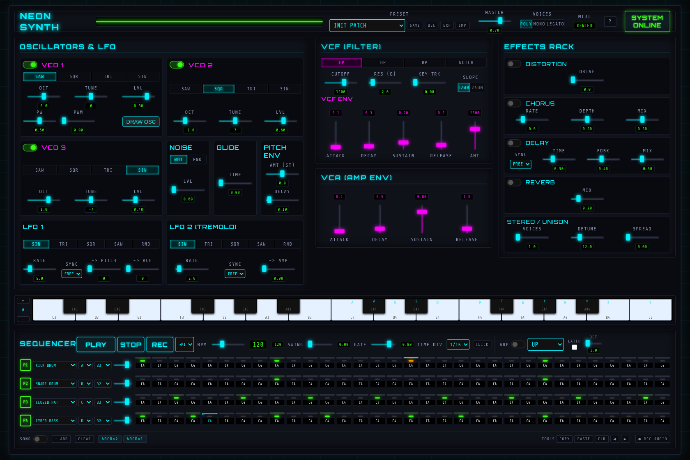
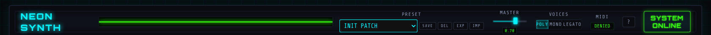
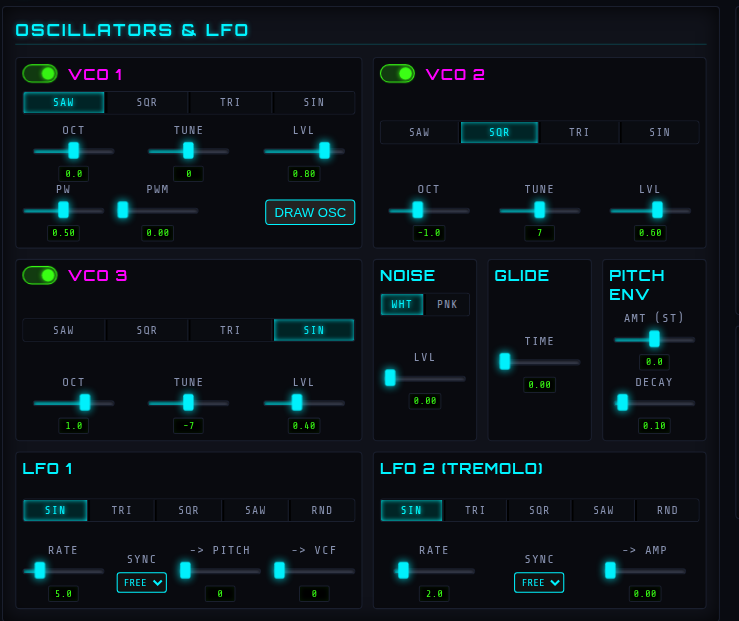
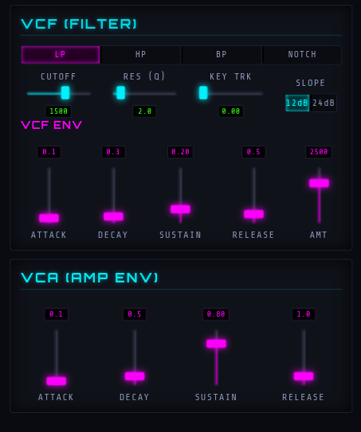
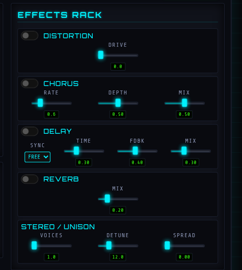
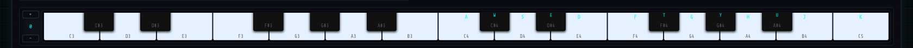
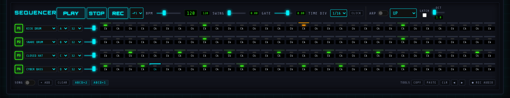
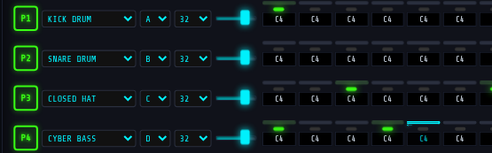
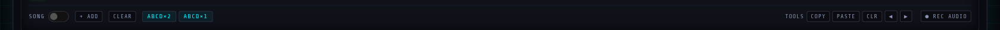

# Neon Synth — Anleitung

*English version: [MANUAL.md](MANUAL.md)*

Neon Synth ist ein analog inspirierter Synthesizer mit einem viergleisigen,
multi-timbralen 32-Step-Sequencer — eine komplette Groovebox, die vollständig
im Browser läuft.

## 1. Erste Schritte

1. Öffne die [Live-Version](https://laserrapt0r.github.io/html5-synth/) — oder
   starte lokal einen Webserver im Projektordner (`python3 -m http.server`),
   da ES-Module nicht über `file://` laden.
2. Klicke **INIT AUDIO**. Browser verlangen eine Nutzer-Geste, bevor sie Ton
   erlauben; dabei wird auch die MIDI-Berechtigung abgefragt, falls ein
   Keyboard angeschlossen ist.
3. Drücke **PLAY** am Sequencer oder spiele die Bildschirm-Klaviatur.

Alles, was du machst — Sound, Patterns, Song — wird **automatisch im Browser
gespeichert** und beim nächsten Besuch wiederhergestellt.

## 2. Der Header

- **PRESET** — 28 Werks-Presets, nach Kategorien gruppiert (BASS, LEAD, KEYS,
  PAD, DRUMS, FX), plus deine eigenen Patches.
  **SAVE** speichert den aktuellen Sound als User-Patch, **DEL** löscht ihn,
  **EXP/IMP** exportieren/importieren das komplette Projekt als JSON-Datei.
- **MASTER** — Ausgangslautstärke (dahinter verhindert ein Limiter digitales
  Clipping).
- **VOICES** — POLY (16 Stimmen), MONO (mit Retrigger und Notengedächtnis)
  oder LEGATO (ohne Retrigger, mit Glide zwischen den Noten).
- **MIDI** — Verbindungsstatus der MIDI-Eingänge (`1 IN`, `NO DEV`, `N/A` in
  Safari).
- **?** — öffnet die eingebaute Gesten- und Shortcut-Übersicht.

## 3. Oszillatoren & LFOs

- **VCO 1–3** — drei Oszillatoren mit SAW/SQR/TRI/SIN, Oktave (±3), Feintuning
  (±1200 Cent) und Lautstärke. VCO 1 bietet zusätzlich **Pulsbreite (PW)**,
  **PWM** (LFO 1 moduliert die Breite) und **DRAW OSC**: Zeichne deine eigene
  Wellenform — sie wird per Fourier-Analyse in Echtzeit synthetisiert.
- **NOISE** — weißes oder rosa Rauschen, das Rückgrat der Drum-Presets.
- **GLIDE** — Portamento-Zeit für MONO/LEGATO (zugleich die Slide-Zeit für
  Sequencer-Ties).
- **PITCH ENV** — eine Tonhöhen-Hüllkurve (±48 Halbtöne, Decay): Kicks, Toms,
  Zaps.
- **LFO 1** — moduliert Tonhöhe, Filter-Cutoff und PWM. **LFO 2** ist ein
  Tremolo. Beide haben einen **Random-Modus (S&H)** und lassen sich per
  **SYNC** ans Tempo koppeln (1/1 … 1/16), statt frei zu laufen.

## 4. Filter & Hüllkurven

- **VCF** — Tiefpass, Hochpass, Bandpass oder Notch. Der **CUTOFF**-Regler ist
  logarithmisch skaliert (musikalisch gleichmäßig über den ganzen Weg) und
  wirkt auf *klingende* Noten. **KEY TRK** lässt das Filter der gespielten
  Tonhöhe folgen, **SLOPE** schaltet zwischen 12 und 24 dB/Oktave um.
- **VCF ENV** — ADSR plus **AMT** (±5000 Hz, negative Werte kehren den Sweep
  um). Der Amount skaliert mit der Velocity — akzentuierte Steps reißen das
  Filter weiter auf.
- **VCA (AMP ENV)** — die Lautstärke-Hüllkurve. Hüllkurven retriggern
  knackfrei.

## 5. Effekte & Stereo

Die Kette ist Distortion → **Chorus/Ensemble** (stereo, das Solina-Geheimnis) →
Delay (frei oder **BPM-synchron**: 1/4, 1/8., 1/8, 1/8T, 1/16) → Reverb.
**STEREO/UNISON** schichtet bis zu 3 verstimmte Stimmen pro Note
(VOICES/DETUNE) und verteilt sie im Stereofeld (SPREAD). Die Effekte sind
global — alle vier Sequencer-Tracks teilen sie sich wie einen FX-Bus am
echten Gerät.

## 6. Die Klaviatur

- **Maus** — die Klickposition bestimmt die Velocity: weiter unten auf der
  Taste = lauter.
- **Computertastatur** — die Reihe A–K spielt Noten; die Beschriftung passt
  sich deinem Tastaturlayout an (QWERTZ/AZERTY werden erkannt). **+/−** links
  verschiebt die Oktave (±2).
- **MIDI-Keyboard** — volle Velocity, **Pitch-Bend**, **Mod-Wheel** (fügt
  Vibrato hinzu) und **Sustain-Pedal**.

## 7. Der Sequencer

### Tracks

Jeder der vier Tracks hat links neben seinem Step-Grid:

- **P1–P4** — stummschalten/aktivieren.
- **Sound-Auswahl** — der eigene Sound des Tracks: jedes Werks-Preset oder
  jeder User-Patch, oder **LIVE** (der aktuell am Synth-Panel eingestellte
  Sound). Das macht die Tracks multi-timbral: Kick, Snare, Hats und Bass als
  wirklich verschiedene Sounds. Zugewiesene Sounds sind vom Panel-Preset
  isoliert — sie behalten ihre eigenen Voice-Parameter, LFO-Tiefen und
  Unison-Einstellungen. Nur die Effektsektion und Wellenform/Tempo der LFOs
  bleiben global (ein geteilter FX-Bus wie bei Hardware-Grooveboxen).
- **Bank A–H** — welche der 8 Pattern-Banks der Track spielt. Bei laufendem
  Sequencer werden Wechsel auf den Loop-Anfang **quantisiert** (ausstehend =
  blinkend).
- **LEN** — Loop-Länge (1–32) dieser Bank. Unterschiedliche Längen laufen
  **polymetrisch** gegeneinander.
- **Lautstärke-Slider** — Track-Pegel (Mini-Mixer).

### Steps

| Geste | Aktion |
|---|---|
| Klick | Step an/aus |
| **Strg+Klick** | Accent — lauter, Filter weiter offen (orange LED) |
| **Rechtsklick** | Tie — verlängert die Vornote. Ein Tie mit *anderer Tonhöhe* **slidet** dorthin (303-Stil) |
| **Shift+Klick** | P-Lock-Modus: Jeder Regler, den du jetzt bewegst, gilt nur für diesen Step |
| **Mausrad** | Trigger-Wahrscheinlichkeit (100/75/50/25 %) |
| **Shift+Rad** | Ratchet — 1–4 Wiederholungen innerhalb des Steps |
| **Strg+Rad** | Trig-Condition (1:2 … 4:4): spielt nur in passenden Loop-Durchläufen |
| **Strg+Z / Strg+Y** | Pattern-Änderungen rückgängig machen / wiederholen |

Wahrscheinlichkeit, Ratchet und Condition erscheinen als kleine gelbe
Infozeile auf dem Step (z. B. `75% ×2 1:2`).

### Transport, Aufnahme & Song

- **PLAY** wechselt zwischen Play und Pause (Position bleibt erhalten),
  **STOP** springt auf Step 1 zurück und schneidet klingende Noten ab.
- **REC** nimmt dein Spiel in den **→P**-Ziel-Track auf — im Stand Schritt für
  Schritt, bei laufendem Sequencer quantisiert auf den Beat. **CLICK**
  aktiviert das Metronom und liefert bei scharfem REC einen 1-Takt-Einzähler.
- **TOOLS** — Kopieren/Einfügen/Löschen und Rotieren (◀ ▶) des
  Ziel-Track-Patterns.
- **SONG** — Szenen verketten: **+ADD** erfasst die aktuelle Bank-Auswahl
  aller vier Tracks als Szene, Klick auf einen Chip erhöht die Wiederholungen,
  Rechtsklick entfernt ihn. Mit aktivem SONG steuert die Kette die Banks
  automatisch.
- **● REC AUDIO** — schneidet den Master-Ausgang mit und lädt ihn als
  Audiodatei herunter.

### Ein Groove in 60 Sekunden

1. Track P1: Sound **KICK DRUM**, Steps 1, 9, 17, 25.
2. Track P2: Sound **SNARE DRUM**, Steps 9 und 25.
3. Track P3: Sound **CLOSED HAT**, alle Off-Beats — gib zweien davon 50 %
   Wahrscheinlichkeit (Mausrad) und einem ein ×2-Ratchet (Shift+Rad).
4. Track P4: Sound **CYBER BASS**, ein paar Noten — setze einen Tie mit
   anderer Tonhöhe für einen Slide.
5. PLAY. Schraube am LIVE-Panel (Filter!) — es wirkt nur auf Tracks, die auf
   LIVE stehen.
6. **● REC AUDIO**, jammen, stoppen — die Datei lädt automatisch herunter.

## 8. Tipps

- Der **Arpeggiator** (ARP-Schalter) spielt gehaltene Akkorde in 8 Mustern,
  synchron zur Clock; LATCH lässt sie nach dem Loslassen weiterlaufen.
- **Swing** verzögert die Off-Steps für Groove, **GATE** bestimmt die
  Notenlängen, **TIME DIV** schaltet zwischen 1/8, 1/16 und 1/32 um.
- Alle Regler reagieren aufs **Mausrad** — schnell drehen für grobe Sprünge,
  langsam für feine Schritte.
- Safari unterstützt kein Web MIDI; für MIDI-Eingabe Chrome/Edge/Firefox
  verwenden.
